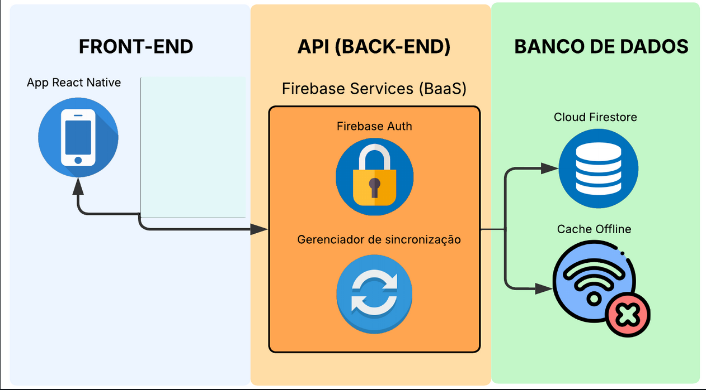
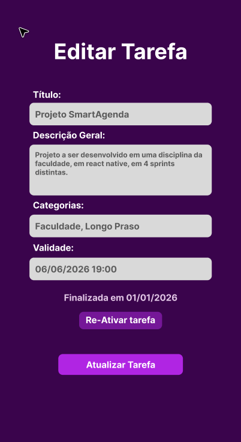

# 4. Projeto da Solução

---

## 4.1 Arquitetura da Solução (Sprint 1 e 2)

A arquitetura do SmartAgenda foi projetada sob um paradigma Híbrido e Serverless, com o objetivo de oferecer máxima performance e funcionamento offline

### Diagrama de Arquitetura do Projeto
 
 

## 4.2 Tecnologias Utilizadas

| Dimensão | Tecnologia Escolhida |
|----------|----------------------|
| **Banco de Dados (SGBD)** | Firebase Cloud Firestore (NoSQL) |
| **Back-end API** | Firebase, utilizando Firebase Auth para autenticação de usuários. |
| **Front-end / Mobile** | React Native e React. |
| **Inteligência Artificial em Nuvem** | Gemini. |
| **Ambiente e Emulação** | Android Studio (Android SDK) atuando em conjunto com o Metro Bundler. |
| **Notificações** | Notifee |
| **Renderização de Quadro** | React Native SVG |
| **Gestão e Versionamento** | GitHub. |

 ⚠️ **Observação:**
 - O sistema não requer hospedagem ou deploy de um servidor próprio por conta do Firebase.

---

##  4.3 Wireframes ou Mockups (A partir da Sprint 2)

### Tela de Gerenciamento de Tarefa (RF-01)

**História associada:** Como usuário, eu quero criar, editar, atualizar e excluir tarefas, para que eu possa me programar e manter um registro preciso dos meus afazeres.

**Descrição:** Página ou Modal que permite a alteração das informações de uma tarefa, a serem salvas no AsyncStorage, depois salvas no dispositivo local, depois salvas como backup no Firebase.

### Tela de Login (RF-01)

**História associada:** Como usuário, eu quero criar uma conta e realizar login no sistema, para que eu possa associar meus dados localmente e sincronizá-los com segurança na nuvem.

**Descrição:** Tela de autenticação onde o sistema permite que os usuários realizem cadastro e login informando e-mail e senha. Serve como porta de entrada para a sincronização dos dados locais com o Firebase.

---

### Tela de Cadastro (RF-01)

**História associada:** Como usuário, eu quero criar uma conta no sistema, para que eu possa acessar minhas tarefas de forma personalizada e sincronizá-las na nuvem.

**Descrição:** Tela de cadastro de novos usuários. O usuário informa nome, e-mail e senha. Após o cadastro, o sistema cria automaticamente o usuário no Firebase Authentication e no Firestore, com sua coleção de tarefas.

---

### Tela da Lista de Tarefas (RF-05 e RF-06)

**História associada:** Como usuário, eu quero visualizar a lista das minhas tarefas ordenadas por vencimento e acessar seus detalhes, para que eu não me esqueça do que precisa ser feito primeiro.

**Descrição:** Página principal que permite aos usuários visualizarem as tarefas registradas em forma de lista, ordenadas pela data de validade mais próxima. Inclui filtros dinâmicos para alternar entre "Pendentes" e "Concluídas".

---

### Tela de Detalhes da Tarefa (RF-03, RF-04 e RF-06)

**Histórias associadas:** 
- Como usuário, eu quero visualizar a lista das minhas tarefas ordenadas por vencimento e acessar seus detalhes, para que eu não me esqueça do que precisa ser feito primeiro.
- Como usuário, eu quero poder marcar rapidamente minhas tarefas como concluídas com um menu de confirmação, para que eu tenha a sensação de progresso e limpe minha lista de pendências.

**Descrição:** Modal que permite aos usuários selecionarem as tarefas exibindo mais detalhes sobre elas. A partir desta tela, o sistema permite que o usuário navegue para a página de edição da tarefa ou marque a tarefa como completa.

---

## 4.4 Modelagem de Dados (Sprint 2 e 3)

O sistema utiliza Firebase Firestore como banco de dados NoSQL, integrado com Firebase Authentication para gerenciamento de usuários.

---

### 4.4.1 Script Físico (Entrega na Sprint 2 - MVP)

Coleção usuarios:

Subcoleção tarefas (dentro de cada usuário):

Estrutura no Firebase:

### 📁 Obrigatório

O arquivo .sql ou .js deve ser salvo na pasta: src/bd

 - É permitido colar um trecho do script no README apenas para visualização rápida.
 
---
### 4.4.2 Representação do Modelo Físico de Dados (Entrega na Sprint 3 - Core)

### 📎 Representação do Modelo Físico de Dados

---
