# 5. Interface do Sistema

> ⚠️ **Aviso aos Squads:**
> Diferente da Seção 4 (onde vocês colocaram os wireframes/Mockups), esta seção é o **Portfólio Visual** do software real. Aqui devem constar apenas as capturas de tela (screenshots) do **sistema já codificado e funcionando**.

Esta seção deve ser atualizada a cada Sprint, servindo como um registro histórico da evolução da interface da aplicação web.   

## 5.1. Galeria de Telas (Por Sprint)

Apresente as imagens reais das telas implementadas, associando-as à funcionalidade (Fatia Vertical) entregue na Sprint correspondente. Descreva brevemente o que cada tela faz.  

**🟢 Sprint 1: Hello World / Tela Inicial**
* **Funcionalidade:** Ponto de entrada do sistema e navegação principal.
* **Descrição:** Tela inicial conectada à API, provando que o fluxo base da aplicação está funcionando.

> 💡 **Importante:** Uma mesma funcionalidade (fatia) pode render **várias telas** (ex: tela de listagem, formulário de cadastro e modal de sucesso). **Coloque prints de todas as etapas do fluxo.**   

**🟡 Sprint 2: MVP (Primeira Fatia Vertical)**
* **Funcionalidade:** *(Ex: Cadastro de Cliente e Listagem)*
* **Descrição:** Formulário interativo que envia os dados para a API e salva com sucesso no Banco de Dados.

> 💡 **Importante:** Uma mesma funcionalidade (fatia) pode render **várias telas** (ex: tela de listagem, formulário de cadastro e modal de sucesso). **Coloque prints de todas as etapas do fluxo.**   

**🔵 Sprint 3: Core (Regras de Negócio)**
* **Funcionalidade:** *(Ex: Dashboard de Análise ou Fluxo de Pagamento)*
* **Descrição:** Interface que demonstra as regras de negócio mais complexas do sistema operando com dados reais do banco.

> 💡 **Importante:** Uma mesma funcionalidade (fatia) pode render **várias telas** (ex: tela de listagem, formulário de cadastro e modal de sucesso). **Coloque prints de todas as etapas do fluxo.**   

**🔴 Sprint 4: Entrega Final**
* **Funcionalidade:** Lista de Tarefas
* **Descrição:** Tela onde são listadas todas as tarefas principais (que não são subtarefas) registradas no sistema, sendo interagíveis e filtráveis.
* 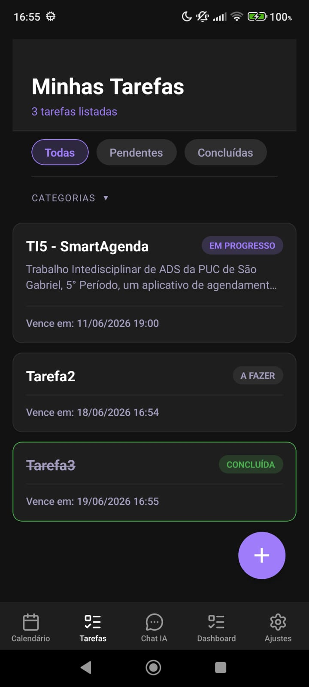 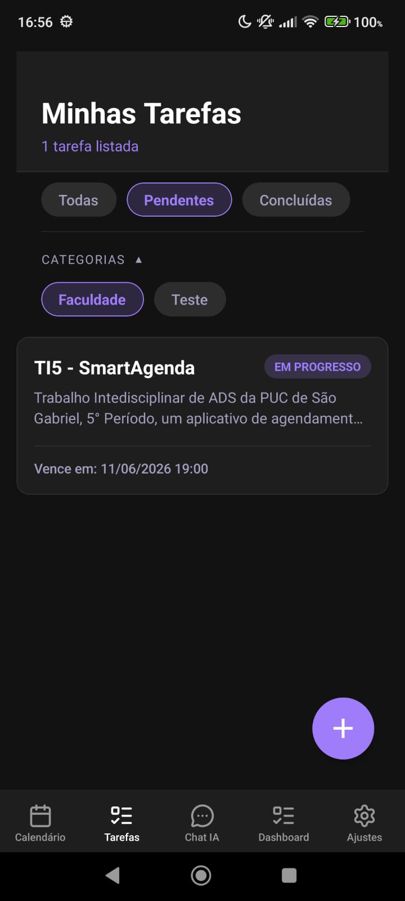 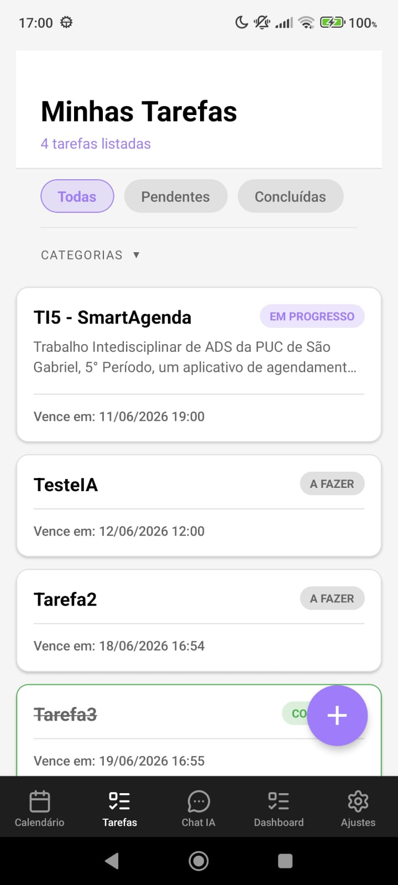   

* **Funcionalidade:** Detalhes de Tarefa
* **Descrição:** Tela onde são listadas todos os detalhes da tarefa selecionada, sendo possível ser encaminhado para edição de tarefa, visualizador em árvore, ou visualizar os detalhes de uma subtarefa (se houver), além de poder finalizar a tarefa.
*  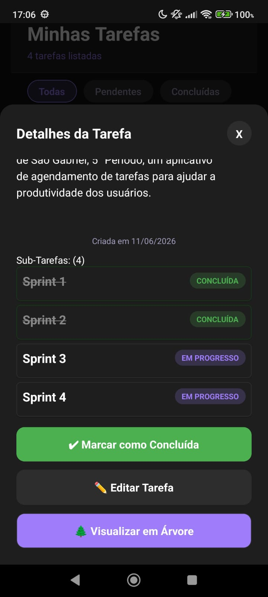 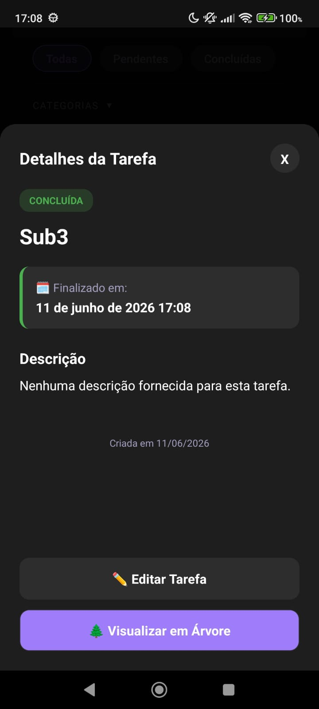   

* **Funcionalidade:** Gerenciador de Tarefas
* **Descrição:** Tela onde pode-se editar todos os aspectos das tarefas, além de poder adicionar subtarefas a ela, e exclui-la (botão kebab no canto superior direito).
* 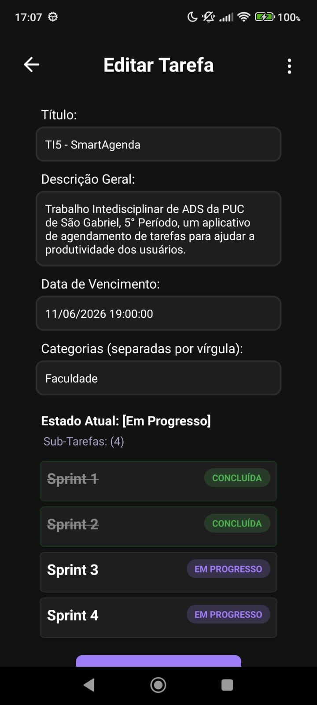 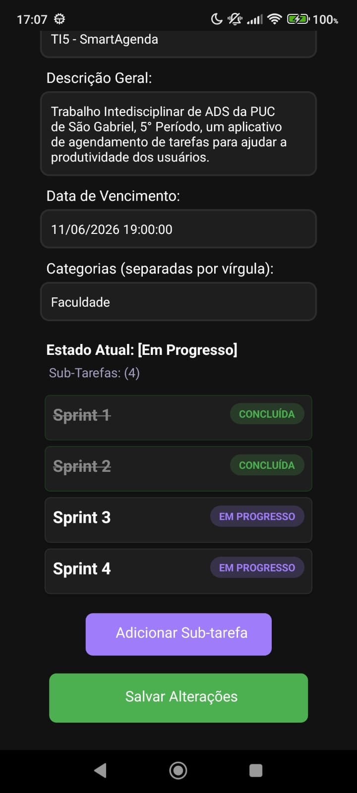 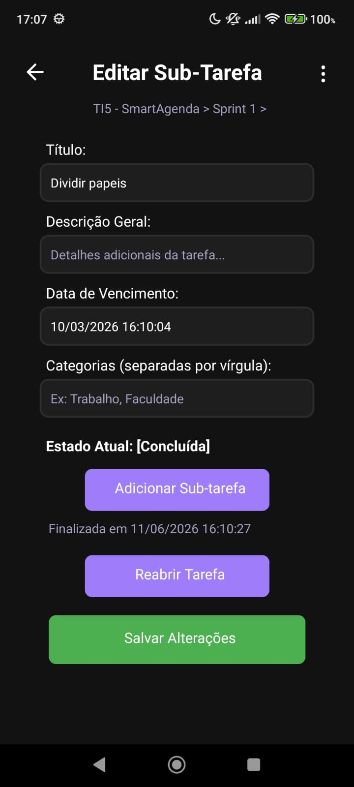   

* **Funcionalidade:** Página de Calendário
* **Descrição:** Tela onde todas as tarefas (principais e subtarefas) são listadas em forma de calendário, cada uma no dia de seu vencimento, sendo interagíveis e filtráveis.
* 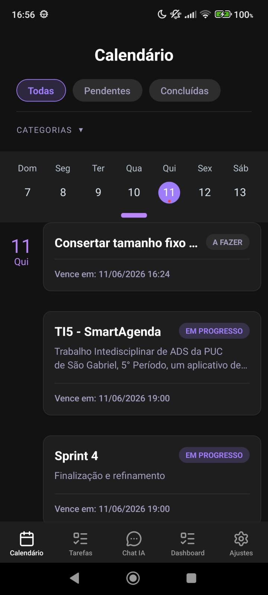 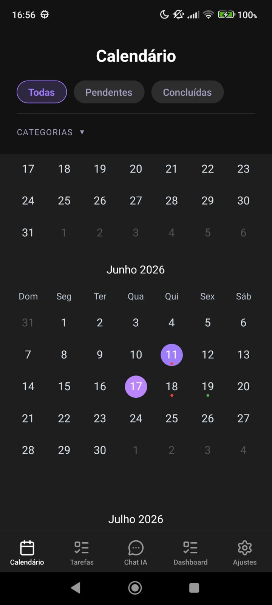   

* **Funcionalidade:** Visualizador em Árvore
* **Descrição:** Tela que exibe o contexto geral de uma tarefa e suas subtarefas, em forma de árvore, demonstrando somente seu estado, sendo cada nó interagível e a tela navegável por toque e com alteração de nível de zoom.
* 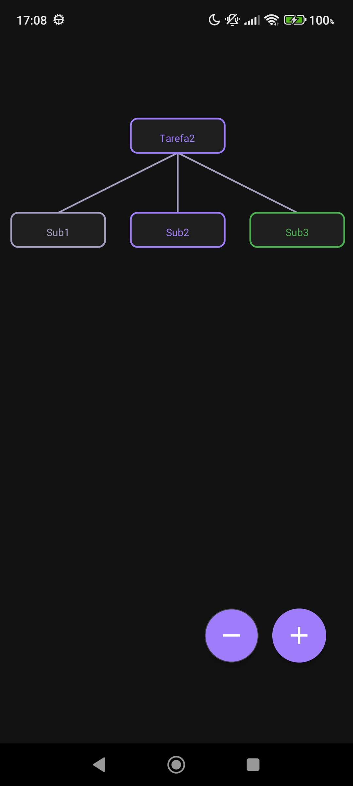   

* **Funcionalidade:** Chat de IA
* **Descrição:** Tela é possível conversar com a IA em nuvem para realizar funções com as tarefas, que são guardadas em um histórico em um menu.
*  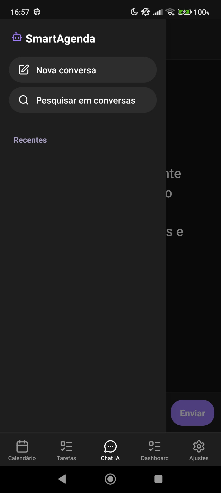     

* **Funcionalidade:** Dashboard
* **Descrição:** Tela que exibe o contexto geral de progresso em todas as tarefas registradas, destacando as mais urgentes, e quantificando por estado. Além de disponibilizar a impressão de um relatório desse contexto.
* 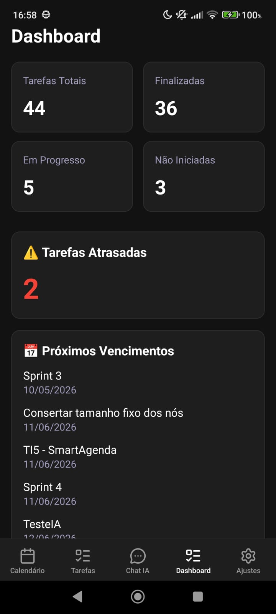 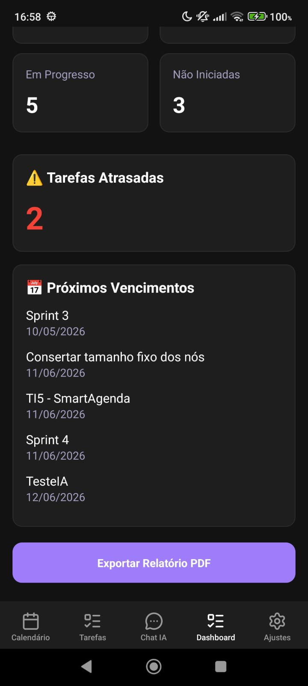 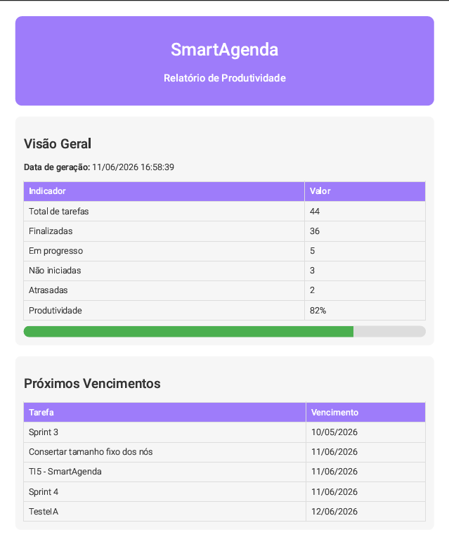 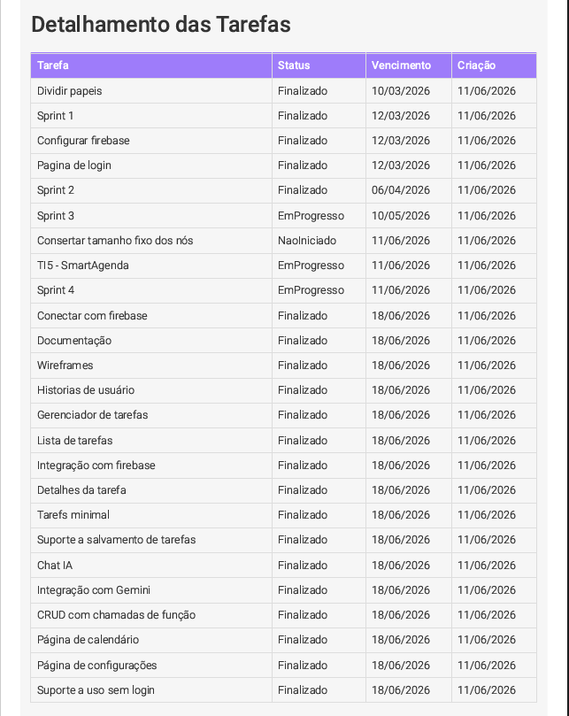 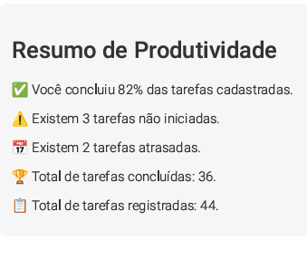   

* **Funcionalidade:** Configurações
* **Descrição:** Tela que exibe opções alternáveis que o usuário pode personalizar. A opção de notificações abre um submenu que permite a personalização das notificações.
* 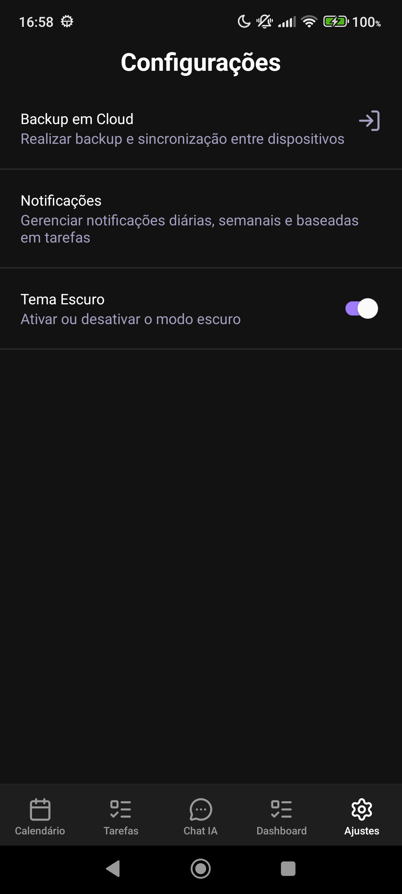 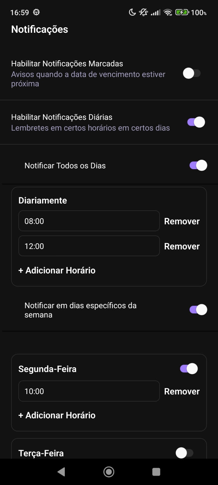   

